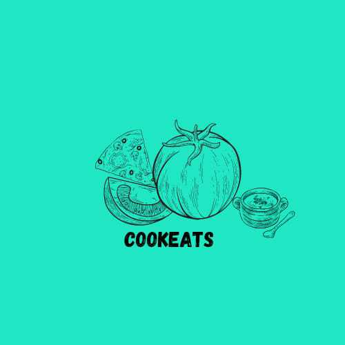
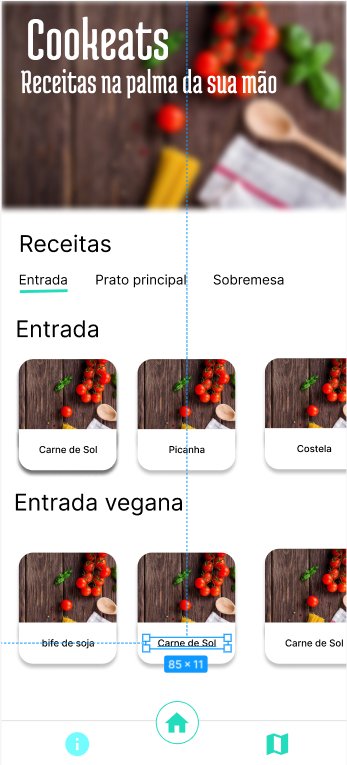
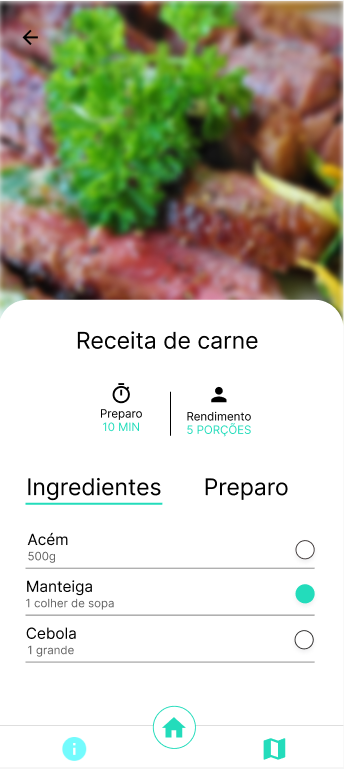
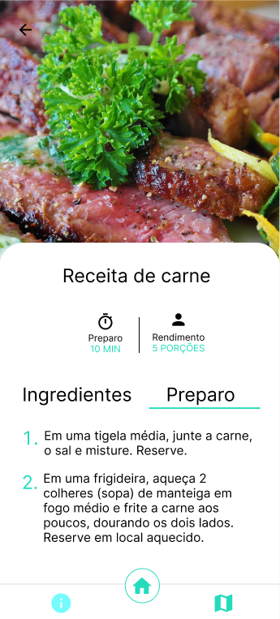

##  Cookeats 
Aplicativo criado com o Expo que apresenta diversas receitas.

<p align="center">
  <a href="#-tecnologias">Tecnologias</a>&nbsp;|&nbsp;
  <a href="#-projeto">Projeto</a>&nbsp;|&nbsp;
  <a href="#-layout">Layout</a>
</p>

## 🚀 Tecnologias

Esse projeto foi desenvolvido com as seguintes tecnologias:

- React Native   `Versão:0.69.6`
- JavaScript     `Versão:EC6`
- Node           `Versão:16.6.1`
- Expo           `Versão:46.0.16`


## 💻 Projeto

O Cookeats apresenta diversos pratos, tanto como entrada, prato principal e até sobremesa, além de muitas opções veganas. É exibido o tempo de preparo e o rendimento por pessoa.

## 🔖 Layout

#### Tela inicial

Com uma possivel navegação entre os pratos e um card clicavel que encaminha as receitas.

<p align="center">
  
</p>


#### Tela da Receita

Veja o tempo de preparo, os ingredientes e o rendimento:

<p align="center">
  
</p>

#### Tela de Preparo

Além da possivel vizualização do rempo e rendimento, é visivel o modo de preparo:

<p align="center">
  
</p>


#### Tela de Localização

Indique o Cep do seu local para ver os mercados mais proximos:

<p align="center">
  
</p>    


### [`Clique aqui para vizualizar o prototipo do projeto`](https://www.figma.com/file/d2xhfvrFl7ZRwVkj9OKEhB/Receita?node-id=0%3A1&t=CUSBMVwjdNo5MZPo-0)

## :memo: Rodando a aplicação

Instale as dependências com [](https://docs.npmjs.com/getting-started):

```
$ npm install 
```

Teste o aplicativo no seu celular usando o expo:

```
$ expo start 
```

---

Feito com ♥ by Cookeats :wave:
